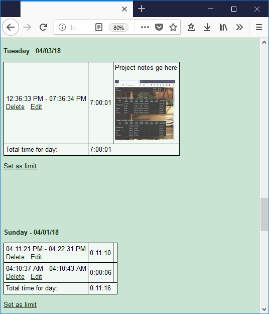
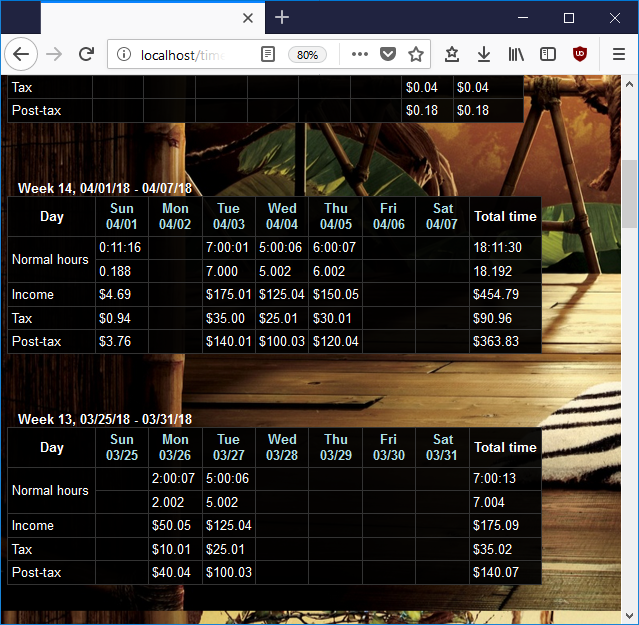

## Download TimeShade - a free tool to help you count work hours

### LATEST RELEASE:

### Download here: [TimeShade version 1.00](https://github.com/andreizilla/TimeShade/raw/master/TimeShade.msi)

**TimeShade is a Microsoft Windows application**

TimeShade requires 2 additional packages from Microsoft to run. It comes with these packages in the installer and will
try to install them upon first run. If you wish to install these required packages manually then follow these directions:

Install this: [IIS Express](https://www.microsoft.com/en-us/download/details.aspx?id=48264)

at the page "Choose the download you want":

64-bit computer: Check ***"iisexpress_amd64_en-US.msi"*** 

32-bit computer: Check ***"iisexpress_x86_en-US.msi"*** 

Also install this: [Visual C++ Redistributable for Visual Studio 2012](https://www.microsoft.com/en-us/download/details.aspx?id=30679)

at the page "Choose the download you want":

64-bit computer: Check ***"VSU_4\vcredist_x64.exe"*** 

32-bit computer: Check ***"VSU_4\vcredist_x86.exe"*** 

**TimeShade is a Microsoft Windows application**

**TimeShade does NOT require Administrative privileges to install, but you might get prompted in Install Microsoft IIS Express (which is the web server that hosts the TimeShade files on your computer)**

TimeShade is a website (web app) which runs on your computer locally, at the address "http://localhost:8080/start.php".
It is useful to have a bookmark to TimeShade in your browser to help you apply for jobs.

After installing, you will have a **"Start TimeShade"** stortcut in your **Start menu** and **Desktop**.

### Screenshots

History:

Version 1.00 Released 1/20/2020
- Initial Windows release

### The official website domain for TimeShade is: [http://TimeShade.tk](http://TimeShade.tk)

### TimeShade is developed by ShadySoft, LLC: [http://ShadySoft.tk](http://ShadySoft.tk)

